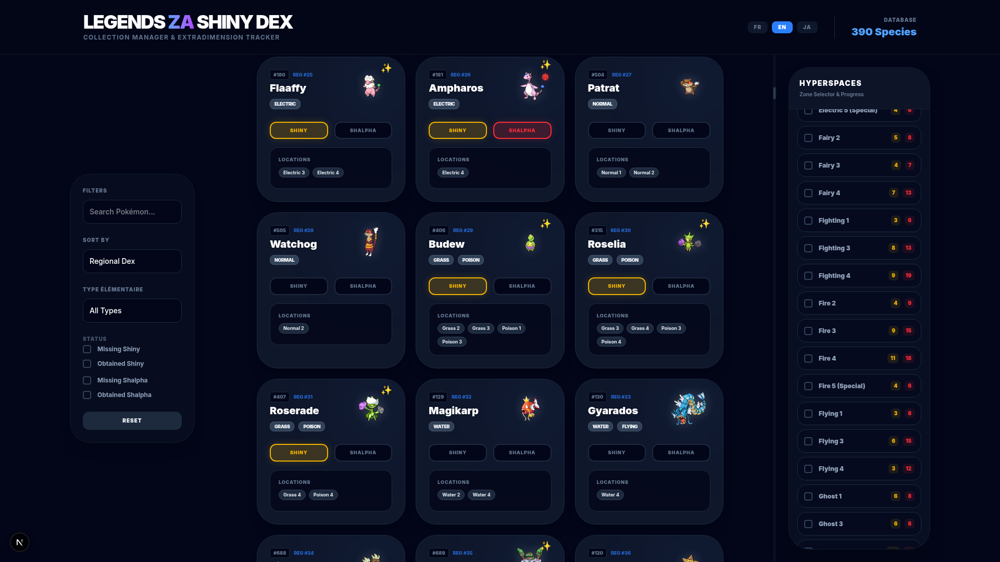

# Legends ZA Shiny Dex

Un traqueur de collection complet pour **Pokémon Légendes : Z-A**, conçu pour suivre votre progression de capture Shiny et Shalpha à travers les différentes Extradimensions.



## 🚀 Fonctionnalités

- **Base de données complète** : 390 espèces répertoriées avec types officiels (via PokéAPI).
- **Localisations précises** : Données extraites de PokéBip pour chaque niveau d'Extradimension (1★ à 5★).
- **Suivi Shalpha & Shiny** : Marquez vos captures en un clic. La logique Shalpha inclut automatiquement le statut Shiny.
- **Filtres Avancés & Stackables** :
  - Recherche par nom (insensible aux accents et tolérante aux fautes de frappe).
  - Filtrage par Type élémentaire.
  - Filtrage par statut (Manquants ou Obtenus).
- **Tableau de Bord des Extradimensions** : Suivez votre progression zone par zone avec des compteurs en temps réel et des badges de complétion.
- **Règles Spéciales** : Gestion automatique des Pokémon **Shiny-Locked** et **Alpha-Locked** (légendaires, etc.).
- **Sprites Dynamiques** : Affichage des sprites officiels qui passent en version Shiny dès que vous validez la capture.

## 🛠️ Installation et Configuration

### Prérequis
- [Node.js](https://nodejs.org/) (v18 ou supérieur)
- npm (installé avec Node.js)

### Setup
1. **Cloner le dépôt**
   ```bash
   git clone https://github.com/votre-username/ZA-ShinyDex.git
   cd ZA-ShinyDex
   ```

2. **Installer les dépendances**
   ```bash
   npm install
   ```

3. **Initialiser la base de données**
   Cette commande crée la structure SQLite locale et peuple la base avec les données de base (progression à zéro).
   ```bash
   npm run setup
   ```

4. **Lancer l'application**
   ```bash
   npm run dev
   ```
   L'application sera accessible sur [http://localhost:3000](http://localhost:3000).

## 📖 Structure du Projet

- `src/app/page.tsx` : Interface principale avec la logique de filtrage Fuzzy et le rendu des composants.
- `prisma/schema.prisma` : Schéma de la base de données SQLite.
- `prisma/seed_data.json` : Données sources propres pour l'initialisation.
- `src/app/api/` : Points d'accès pour la recherche et la mise à jour de la progression.

## 📝 Données
Les données de localisation proviennent de [PokéBip](https://www.pokebip.com/). Les typages et sprites sont fournis par [PokéAPI](https://pokeapi.co/).

---
*Développé avec passion pour les dresseurs de Pokémon.*
